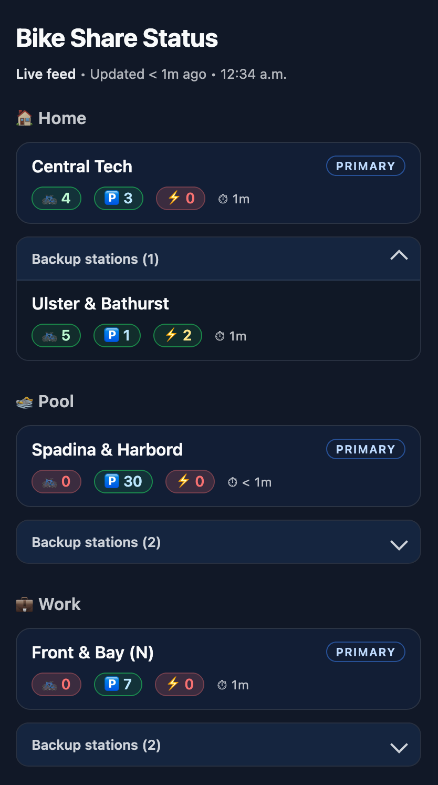
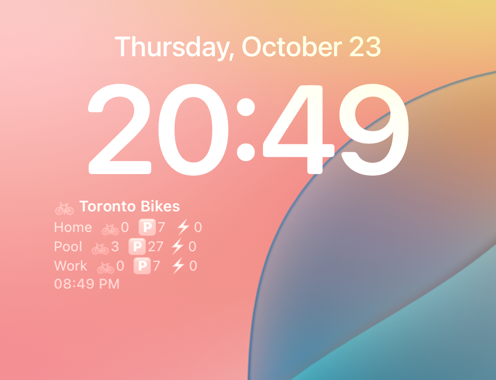

# Toronto Bike Share Status

## Screenshots
### Website

### Widget

## About

A client-side web app to track real-time bike and dock availability at Toronto Bike Share stations. Save your frequently used stations as favorites for quick access.

There is also a standalone script, `compact-widget.js`, that can be embedded as an iOS widget using [Scriptable](https://scriptable.app/).

## Features

- **Real-time data** - Station availability updates from the official Toronto Bike Share API
- **Favorites** - Save stations for quick access with custom labels (e.g., "Home", "Work", "Gym")
- **Backup stations** - Link nearby stations to your favorites so you can see alternatives at a glance
- **Fuzzy search** - Filter stations by name to quickly find what you need
- **Local storage** - Your favorites are stored in your browser and persist across sessions

## Using the Scriptable Widget

1. Install the free [Scriptable](https://scriptable.app/) app on your iOS device
2. Create a new script, paste in the contents of `compact-widget.js`
3. Adjust the `SECTIONS` array near the top of the script to target your preferred stations (station names must match Bike Share Toronto's official feed)
4. Add a Small Scriptable widget to your Home Screen and choose the script you created
5. The widget refreshes roughly every minute (actual refresh cadence is controlled by iOS)

## Customizing Favorites

In the web app:
1. Click the star button to add a station to your favorites
2. Click the pencil icon to add a custom label (like "Home" or "Work")
3. Click the pin icon to select backup stations that appear grouped under your favorite

Your favorites, labels, and backup stations are saved locally in your browser.

Contributions are welcome!
